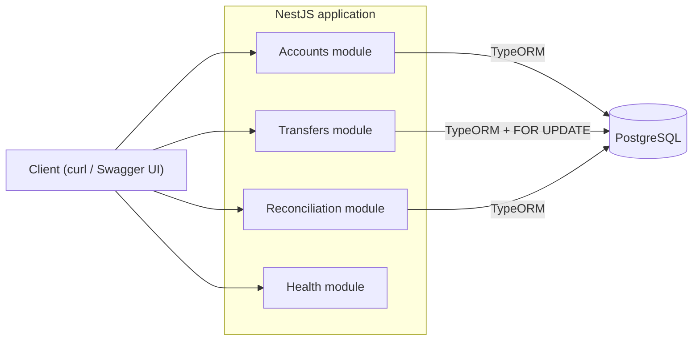
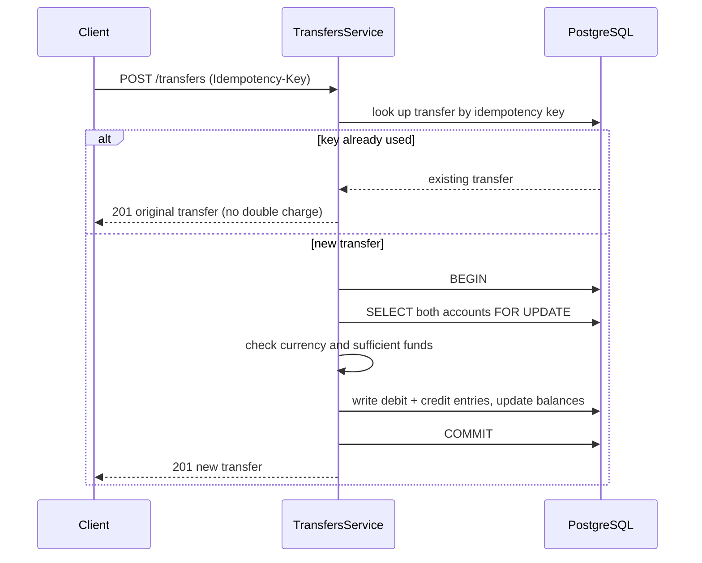

# ledger-core

[](https://github.com/amit-2011/ledger-core/actions/workflows/ci.yml)
[](LICENSE)

A small, production-style **payments core** that moves money correctly: a double-entry
ledger with idempotent, atomic, balanced transfers. Built in NestJS, TypeScript and
PostgreSQL.

> Status: in active development. The service boots with a health check and live API
> docs, and the PostgreSQL schema is in place via migrations. The transfer and
> reconciliation APIs are being built next. See the roadmap below.

## Why this project exists

Almost every product eventually needs to move money: a wallet, a payout system, a
marketplace, in-app credits, subscription billing. Writing the happy path ("take 100
from A, give 100 to B") is easy. The hard part is everything that can go wrong around
it, and that is exactly where real money is lost.

This repository is a compact, well-tested reference implementation of a payments core
that handles those hard parts correctly. It is intentionally small so the important
decisions are easy to read, and intentionally complete so it actually runs.

## The problem it solves

When software moves money, these failures are common, silent, and expensive:

- A customer taps "Pay" twice, or the network retries the request. The transfer is
  applied twice and the customer is charged double.
- A server crashes half way through a transfer. Money leaves one account but never
  arrives in the other, so it simply vanishes.
- Two requests touch the same balance at the same instant. Both read the old balance
  and the account is overdrawn.
- Amounts are stored as floating point numbers. Tiny rounding errors build up until
  the books no longer add up.
- Over time the recorded balances drift away from the actual transaction history, and
  nobody notices until an audit or an angry customer.

These bugs are hard to spot and even harder to fix after money has already moved.
ledger-core is designed to make every one of them impossible by construction.

## What it guarantees

| Guarantee | What it prevents |
| --- | --- |
| Money is stored as integers in minor units (paise / cents), never as floats | Rounding errors and books that do not add up |
| Every write endpoint is idempotent via idempotency keys | Double charges from retries or double clicks |
| The ledger is double-entry: every transfer is balanced (debits equal credits) | Money appearing or disappearing out of nowhere |
| Each transfer is a single atomic database transaction | Half-finished transfers that leave money in limbo |
| Concurrent transfers are serialized with row-level locks (SELECT ... FOR UPDATE) | Race conditions that corrupt balances |
| A reconciliation check verifies balances against the ledger | Silent drift between recorded balances and history |

In short: money cannot be double counted, lost, half-moved, or silently corrupted,
and if anything ever does go wrong, the system can prove it and point straight at it.

## How it works

The data model is deliberately small, just three tables:

- `accounts` hold a running balance in minor units (`balance_minor`, a bigint).
- `transfers` are the header of one balanced movement of money. Each carries a unique
  `idempotency_key`, so the same request can never be applied twice.
- `ledger_entries` are the immutable debit and credit legs of each transfer. For every
  transfer the debits equal the credits, so the books always balance. An account's
  balance is the sum of its entries, which is exactly what reconciliation verifies.

A transfer of money from account A to account B happens inside one database
transaction: the affected rows are locked, both ledger entries are written, both
balances are updated, and the whole thing either commits together or rolls back
together. There is no in-between state.

## Architecture

The app is a standard layered NestJS service. Each feature is a module with a thin
controller over a service; all persistence goes through TypeORM to PostgreSQL.



A transfer is where the reliability guarantees come together: idempotency is checked
first, then the work happens inside one locked transaction.



## Tech stack

- NestJS 11 and TypeScript in strict mode (no implicit `any`)
- PostgreSQL with TypeORM and explicit migrations
- Jest for unit and end-to-end tests
- Swagger / OpenAPI for live, self-documenting API docs
- Docker Compose for a one-command local database
- ESLint and Prettier, enforced

## Requirements

- Node.js 22+
- pnpm 10+
- Docker (for a local PostgreSQL instance)

## Getting started

```bash
pnpm install
cp .env.example .env

pnpm db:up           # start PostgreSQL via docker-compose
pnpm migration:run   # apply the database schema

pnpm start:dev       # start the service in watch mode
```

Then open:

- Health check: http://localhost:3000/health
- API docs (Swagger): http://localhost:3000/docs

## Database commands

```bash
pnpm migration:generate src/database/migrations/SomeName   # create a migration from entity changes
pnpm migration:run                                         # apply pending migrations
pnpm migration:revert                                      # roll back the last migration
pnpm db:down                                               # stop PostgreSQL
```

## Quality checks

```bash
pnpm type-check      # tsc strict, no emit
pnpm lint            # eslint
pnpm test            # unit tests
pnpm test:e2e        # end-to-end tests
pnpm test:cov        # coverage
```

## Deploy to Railway

The repository is deploy-ready. A multi-stage `Dockerfile` builds the app, and on
every deploy any pending migrations run before the API starts (configured in
`railway.json`).

1. Create a new Railway project from this GitHub repo.
2. Add a database: New -> Database -> PostgreSQL.
3. In the app service Variables, add:
   - `DATABASE_URL` = `${{Postgres.DATABASE_URL}}` (references the database over Railway's private network, no TLS needed)
   - `DB_SSL` = `false` (set to `true` only if you connect over the public Postgres URL)
   Railway sets `PORT` automatically.
4. Deploy. Railway builds the Dockerfile, runs migrations, then starts the API.
5. Settings -> Networking -> Generate Domain to get a public URL.

The live demo is then served at:

- Health: `https://<your-app>.up.railway.app/health`
- API docs: `https://<your-app>.up.railway.app/docs`

Once it is live, add the URL to the top of this README.

## API

Available now:

- `GET /health` liveness probe
- `GET /docs` Swagger UI
- `POST /accounts` open an account (always starts at a zero balance)
- `GET /accounts` list accounts, `GET /accounts/:id` read one account and its balance
- `POST /transfers` move money between two accounts, guarded by an `Idempotency-Key` header
- `GET /transfers/:id` read a transfer and its ledger entries
- `GET /reconciliation` verify every recorded balance against the ledger and report any drift

Planned (see roadmap):

- live demo deployment

### Funding an account

Accounts open at a zero balance, so money has to enter the system from somewhere.
A system "External world" account (id `00000000-0000-4000-8000-000000000000`) is the
counterparty for deposits and withdrawals: a deposit is simply a transfer from it to a
user account. It is the only account allowed to go negative, which keeps the sum of all
real balances at zero.

### Example: moving money

```bash
EXTERNAL=00000000-0000-4000-8000-000000000000

# Deposit 10000 (100.00) into Alice from the external account
curl -X POST localhost:3000/transfers \
  -H 'Content-Type: application/json' \
  -H 'Idempotency-Key: deposit-alice-1' \
  -d "{\"fromAccountId\":\"$EXTERNAL\",\"toAccountId\":\"$ALICE\",\"amountMinor\":10000,\"currency\":\"INR\"}"

# Pay Bob 4000 from Alice. Sending the same Idempotency-Key again is a no-op.
curl -X POST localhost:3000/transfers \
  -H 'Content-Type: application/json' \
  -H 'Idempotency-Key: alice-pays-bob-1' \
  -d "{\"fromAccountId\":\"$ALICE\",\"toAccountId\":\"$BOB\",\"amountMinor\":4000,\"currency\":\"INR\"}"
```

## Roadmap

- [x] Project scaffold: NestJS, strict TypeScript, lint, health endpoint, Swagger
- [x] PostgreSQL data layer: entities and migrations for accounts, transfers, ledger entries
- [x] Accounts API: open accounts and read balances
- [x] Transfers API: idempotent, atomic, double-entry transfers with row-level locking
- [x] Test suite proving idempotency, the balance invariant, and concurrent transfers
- [x] Reconciliation: verify balances against the ledger and surface drift
- [ ] Live demo deployment

## Testing notes

Correctness here is not a nice-to-have, so it is tested directly. Alongside ordinary
unit and end-to-end tests, the transfer work will include tests that assert the
invariants the project is about: the same idempotency key applies a transfer exactly
once, every transfer keeps debits equal to credits, and concurrent transfers against
the same account never corrupt the balance.

## Branching model

| Branch | Purpose |
| --- | --- |
| `main` | Production-ready, released code. |
| `uat` | User-acceptance / staging. |
| `development` | Active development; feature branches merge here. |

All three branches are protected. Changes land via pull request, with no direct pushes.

## About

Built by Amit Tank, a senior full-stack engineer with 9+ years building reliable
backend systems in Node.js, NestJS, TypeScript and PostgreSQL. Available for freelance
and senior remote engagements.

- GitHub: https://github.com/amit-2011
- LinkedIn: https://www.linkedin.com/in/amittank2011
